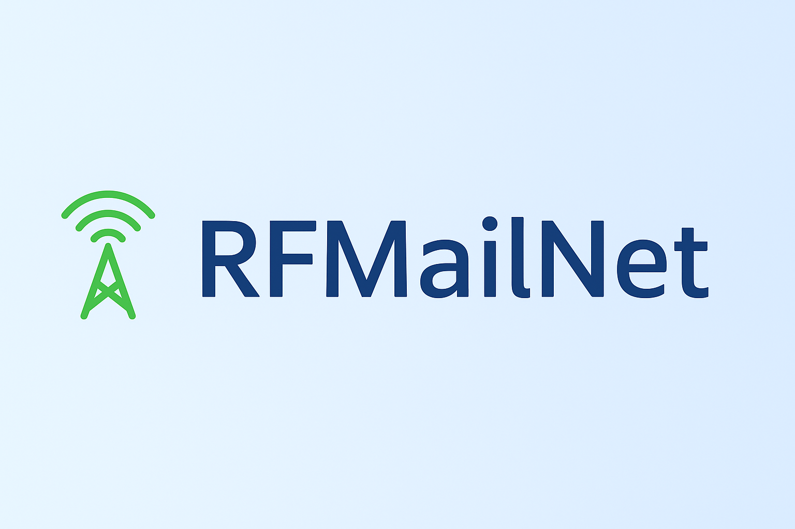

<p align="center">
  
</p>

# 🛰 RFMailNet  
*A lightweight, decentralised RF/IP message transport for amateur radio operators.*

---

## 📦 Overview

**RFMailNet** is an experimental, open-source store-and-forward messaging system designed for the amateur radio community.  
It combines lightweight IP-based gateways with RF or mesh transport to create a **self-discovering, decentralised message network**.

Think of it as a modern, minimal **Winlink-style mail BBS**, but peer-to-peer — built with Python and running comfortably on a Raspberry Pi.

---

## 🧩 Core Features (v0.7)

✅ **Auto-Discovery:**  
Nodes broadcast periodic “HELLO” packets to find and remember nearby peers.  

✅ **Routing Intelligence:**  
Messages are forwarded intelligently based on a dynamically learned `routes.json` table.  

✅ **TTL + Loop Prevention:**  
Built-in safeguards stop message duplication and infinite relays.  

✅ **Persistent Storage:**  
Messages and routes are stored locally under `/var/rfmailnet/`, ensuring resilience even after restarts.  

✅ **Systemd Integration:**  
Runs automatically on boot and restarts on failure — perfect for unattended gateways.

---

## ⚙️ System Architecture

```mermaid
flowchart LR
    A["User Message: curl or CLI"] --> B["RFMailNet Gateway: Raspberry Pi"]
    B -->|"Auto-discovery HELLO"| C["VPS Peer Node"]
    B -->|"Route-based Forwarding"| C
    C -->|"Store in Inbox & Optional Relay"| D["Remote Node(s)"]
    B -.->|"TTL & Loop Check"| B
