<p align="center">
  
</p>

# 🛰 RFMailNet  
*A lightweight, decentralised RF/IP message transport for amateur radio operators.*

---

## 📦 Overview

**RFMailNet** is an experimental, open-source store-and-forward messaging system designed for the amateur radio community.  
It combines lightweight IP-based gateways with RF or mesh transport to create a **self-discovering, decentralised message network**.

Think of it as a modern, minimal **Winlink-style mail BBS**, but peer-to-peer — built with Python and running comfortably on a Raspberry Pi.

---

## 🧩 Core Features (v0.7)

✅ **Auto-Discovery:**  
Nodes broadcast periodic “HELLO” packets to find and remember nearby peers.  

✅ **Routing Intelligence:**  
Messages are forwarded intelligently based on a dynamically learned `routes.json` table.  

✅ **TTL + Loop Prevention:**  
Built-in safeguards stop message duplication and infinite relays.  

✅ **Persistent Storage:**  
Messages and routes are stored locally under `/var/rfmailnet/`, ensuring resilience even after restarts.  

✅ **Systemd Integration:**  
Runs automatically on boot and restarts on failure — perfect for unattended gateways.

---

## ⚙️ System Architecture


### 📨 Message Routing Logic

```mermaid
flowchart TD
    A["Incoming Message Received"] --> B{"Already Seen?"}
    B -- Yes --> C["Ignore (Prevent Loop)"]
    B -- No --> D["Save Message to Inbox"]
    D --> E{"TTL > 0 ?"}
    E -- No --> F["Stop – TTL Expired"]
    E -- Yes --> G{"Known Route for Destination?"}
    G -- Yes --> H["Forward via Discovered Route"]
    G -- No --> I["Forward to Default Peer"]
    H --> J["Mark as Sent / Update TTL"]
    I --> J
    J --> K["Wait for ACK or Next HELLO"]

```



<hr> <h2>🗂 Directory Layout</h2> <table> <tr><th>Path</th><th>Description</th></tr> <tr><td><code>/var/rfmailnet/inbox/</code></td><td>Received messages (JSON files)</td></tr> <tr><td><code>/var/rfmailnet/seen.json</code></td><td>Processed message IDs (loop prevention)</td></tr> <tr><td><code>/var/rfmailnet/routes.json</code></td><td>Discovered peers and routes</td></tr> <tr><td><code>src/rfmail_gateway/main.py</code></td><td>Gateway server + HELLO + TTL forwarding</td></tr> <tr><td><code>src/rfmail_gateway/utils.py</code></td><td>Persistence &amp; helper utilities</td></tr> <tr><td><code>docs/rfmailnet-gateway.service</code></td><td>systemd unit template (optional)</td></tr> </table> <hr> <h2>🚀 Quick Start</h2> <h3>Raspberry Pi (field node)</h3> <pre><code>sudo apt update sudo apt install -y python3 python3-pip git git clone https://github.com/vk2icw/vk2icw-rfmailnet.git cd vk2icw-rfmailnet
Prepare runtime paths

sudo mkdir -p /var/rfmailnet/inbox
sudo chown -R $(whoami):$(whoami) /var/rfmailnet

Run foreground test

python3 src/rfmail_gateway/main.py

In another shell:

curl http://localhost:8080

</code></pre>

<h3>VPS (peer/relay node)</h3> <pre><code>sudo apt update sudo apt install -y python3 python3-pip git cd /root git clone https://github.com/vk2icw/vk2icw-rfmailnet.git
Prepare runtime paths

mkdir -p /var/rfmailnet/inbox
</code></pre>

<h3>Environment (recommended)</h3> <p>Set per host (Pi points to VPS, VPS points to Pi):</p> <pre><code># Pi: export RFMAIL_NODE=VK2ICW-PI export RFMAIL_PEER_URL=http://10.44.0.1:8080
VPS:

export RFMAIL_NODE=VK2ICW-VPS
export RFMAIL_PEER_URL=http://10.44.0.2:8080

</code></pre>

<hr> <h2>🧷 Run as systemd Service</h2> <p>Create the unit (adjust paths/user as appropriate):</p> <pre><code>[Unit] Description=RFMailNet Gateway Service After=network-online.target Wants=network-online.target

[Service]
Type=simple
User=vk2icw
ExecStart=/usr/bin/python3 /home/vk2icw/vk2icw-rfmailnet/src/rfmail_gateway/main.py
Restart=always
RestartSec=2
Environment=RFMAIL_NODE=VK2ICW-PI
Environment=RFMAIL_PEER_URL=http://10.44.0.1:8080

[Install]
WantedBy=multi-user.target
</code></pre>


<p>Enable and start:</p> <pre><code>sudo systemctl daemon-reload sudo systemctl enable rfmailnet-gateway sudo systemctl start rfmailnet-gateway sudo systemctl status rfmailnet-gateway --no-pager </code></pre> <hr> <h2>🧪 Basic Tests</h2> <h3>Status</h3> <pre><code>curl http://localhost:8080 </code></pre> <h3>Send message (from Pi)</h3> <pre><code>curl -X POST http://localhost:8080 -H "Content-Type: application/json" \ -d '{"type":"MSG","msgid":"TEST-001","src":"VK2ICW","dest":"VK2ICW-VPS","subject":"hello","body":"test","ttl":2}' </code></pre> <h3>Verify on VPS</h3> <pre><code>ls -l /var/rfmailnet/inbox cat /var/rfmailnet/inbox/TEST-001.json </code></pre> <h3>Routes after HELLO (~2 min)</h3> <pre><code>cat /var/rfmailnet/routes.json </code></pre> <hr> <h2>🧰 Operations</h2> <ul> <li>Update &amp; restart: <pre><code>cd ~/vk2icw-rfmailnet &amp;&amp; git pull sudo systemctl restart rfmailnet-gateway </code></pre> </li> <li>Logs: <pre><code>journalctl -u rfmailnet-gateway -n 100 --no-pager</code></pre> </li> <li>Ownership: <pre><code>sudo chown -R $(whoami):$(whoami) /var/rfmailnet</code></pre> </li> </ul> <hr> <h2>🧭 Roadmap</h2> <table> <tr><th>Version</th><th>Milestone</th><th>Status</th></tr> <tr><td>0.7</td><td>HELLO + TTL + basic routing</td><td>✅</td></tr> <tr><td>0.8</td><td>ACKs + outbox queue + PGP stub</td><td>Planned</td></tr> <tr><td>0.9</td><td>CLI &amp; web dashboard</td><td>Planned</td></tr> <tr><td>1.0</td><td>HF modem bridge + compression</td><td>Planned</td></tr> </table> <hr> <h2>📚 Documentation</h2> <ul> <li><strong>Wiki Home:</strong> <a href="https://github.com/vk2icw/vk2icw-rfmailnet/wiki">Project Wiki</a></li> <li><strong>Raspberry Pi Gateway Setup:</strong> Wiki page</li> <li><strong>VPS Peer Setup:</strong> Wiki page</li> <li><strong>Network Architecture &amp; Discovery:</strong> Wiki page</li> <li><strong>Troubleshooting &amp; Diagnostics:</strong> Wiki page</li> <li><strong>Developer Guide:</strong> Wiki page</li> <li><strong>Protocol Specification (v0.7):</strong> Wiki page</li> </ul> <hr> <h2>📜 License</h2> <p>MIT License — see <code>LICENSE</code> for details.</p> <hr> <h2>👤 Maintainer</h2> <p><strong>Louis LeMerle (VK2ICW / VK6BH)</strong><br> <a href="https://vk2icw.com">vk2icw.com</a></p> <p align="center"><sub>RFMailNet • Decentralised Amateur Digital Messaging</sub></p> ```

